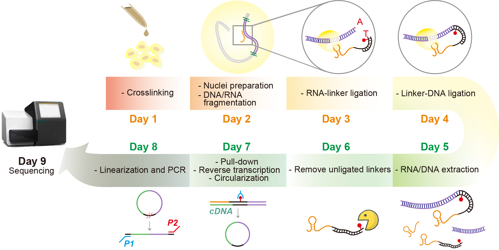
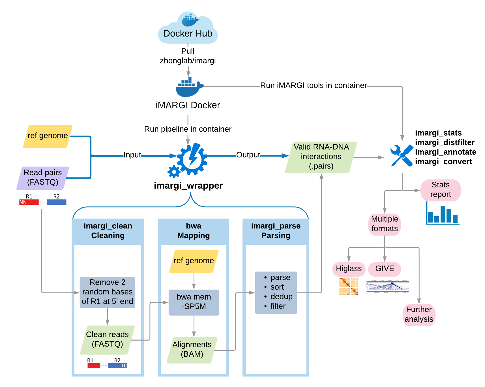

# Overview

Chromatin associated RNAs (caRNAs) are proposed as a new layer of the epigenome. Interactions of caRNAs with chromatin
are essential for diverse molecular and cellular functions. To genome-wide determine the potential genomic interaction
loci of caRNAs, we developed **MARGI** (**MA**pping **R**NA-**G**enome **I**nteractions) <a id="a1">[[1]](#f1)</a>
technique as well as its improved version called *in situ* MARGI
(**iMARGI**) <a id="a2">[[2]](#f2)</a><a id="a3" align="center">[[3]](#f3)</a>. Comparing to
MARGI, iMARGI carries out the ligation steps in the nuclei instead of in solution. As a result, iMARGI requires much
fewer cells for the experiment while obtaining more informative sequencing read pairs.


<i><center>Schematic overview of the iMARGI experimental protocol </i><a id="a3">[[3]](#f3)</a></center>

Here, we introduce the sequencing data analysis pipeline for iMARGI, which is the most critical step for computational
workflow of analyzing RNA-genome interactions. Generally, the pipeline includes three main steps:

- Cleaning: Clean paired-end sequencing reads in FASTQ format
- Mapping: Map sequencing reads to reference genome
- Parsing: Parse and filter to get valid RNA-DNA interaction pairs from mapped read pairs

We distributed the pipeline in a Docker image, [iMARGI-Docker](https://hub.docker.com/r/zhonglab/imargi/), which
delivers all the iMARGI data analysis related tools, such as bwa <a id="a4">[[4]](#f4)</a> and
pairtools <a id="a5">[[5]](#f5)</a>. For convenience, we provide an all-in-one wrapper script `imargi_wrapper.sh` to
automate the whole pipeline in one command line. Users are also able to perform each step separately using its
corresponding tool. In addition, we provide several tools for preparing data for further analysis and visualization.


<i><center>Schematic overview of the iMARGI data analysis pipeline </i><a id="a3">[[3]](#f3)</a></center>

In this documentation, we illustrate the detail of how to use iMARGI-Docker to perform the pipeline and some
instructions for further analysis and visualization.

At first, you need to install Docker CE and pull [iMARGI-Docker](https://hub.docker.com/r/zhonglab/imargi/) from
Docker Hub, See the [Docker container usage instructions](./installation.md). Besides, if you are expert in Linux system
configuration and you want to install all the dependencies on your own computer, you can install and configure all the
required tools following the [dependency tool instructions](./installation.md). As there are a bundle of tools need
to be installed, so we strongly recommend using iMARGI-Docker.

Then [a quick start example](./quick_example.md) shows the simplest all-in-one command used for deciphering the
RNA-DNA interaction map from a real iMARGI dataset. All the detail instructions of the actual processing steps are
described in the
[Step-by-step Illustration](./step_by_step_illustration.md) section.

Besides, we also provide some instructions and tools for further analysis and visualization of RNA-DNA interaction map.
The [Further Analysis and Visualization Guides](./further_analysis.md) section gives you some guides of further
investigating the RNA-DNA interaction map, including generating simple stats report, filtering by genomic distance,
converting data formats, annotating RNA/DNA-ends with gene annotations and using GIVE <a id="a6">[[6]](#f6)</a> or
HiGlass <a id="a7">[[7]](#f7)</a> for interactively visualizing RNA-DNA interaction map.

The [Technical Notes](./technical_note.md) section shows more technical information about the iMARGI-Docker image.
[Command-line API](./commandline_api.md) section lists all the usages and parameters of all the scripts.

**Contents:**

```eval_rst
.. toctree::
   :hidden:

   self
   
.. toctree::
   :maxdepth: 3

   installation
   quick_example
   step_by_step_illustration
   further_analysis
   visualization
   technical_note
   commandline_api
   
```

**Reference:**

<small>[[1]](#a1) <span id="f1"></span> Sridhar, B. et al. Systematic Mapping of RNA-Chromatin Interactions In Vivo. Current Biology 27, 602–609 (2017).</small>

<small>[[2]](#a2) <span id="f2"></span> Yan, Z. et al. Genome-wide co-localization of RNA-DNA interactions and fusion RNA pairs. bioRxiv 472019 (2018). doi:10.1101/472019</small>

<small>[[3]](#a3) <span id="f3"></span> Wu, W., Yan, Z., Wen X. & Zhong, S. iMARGI: Mapping RNA-DNA interactome by sequencing.</small>

<small>[[4]](#a4) <span id="f4"></span> Li, H. & Durbin, R. Fast and accurate short read alignment with Burrows-Wheeler Transform. Bioinformatics, 25:1754-60. (2009).</small>

<small>[[5]](#a5) <span id="f4"></span> [https://github.com/mirnylab/pairtools](https://github.com/mirnylab/pairtools) and [https://pairtools.readthedocs.io/en/latest](https://pairtools.readthedocs.io/en/latest/)</small>

<small>[[6]](#a6) <span id="f4"></span> Cao, X., Yan, Z., Wu, Q., Zheng, A. & Zhong, S. GIVE: portable genome browsers for personal websites. Genome Biology 19, 92 (2018).</small>

<small>[[7]](#a7) <span id="f5"></span> Kerpedjiev, P. et al. HiGlass: web-based visual exploration and analysis of genome interaction maps. Genome Biology 19, 125 (2018).</small>